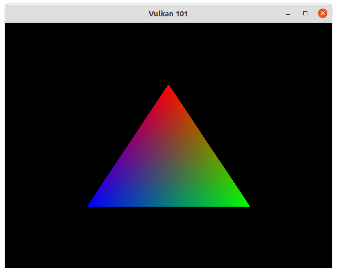

# vulkanHelloWorld
Simple starter code for building applications with Vulkan and C++.

<p>
  
</p>

## Description
This is meant to be a sort of "template" for creating Vulkan applications. It uses `vulkan.hpp`, which is included in LunarG's Vulkan SDK. Note that there are many checks and features that are omitted in this project that would otherwise be present in a "real" application. 

## Tested On
- Ubuntu 20.04.2 LTS
- Intel HD Graphics 5500
- Vulkan SDK `1.1.130.0`
- Vulkan SDK `1.2.162.1`

## To Build
1. Download the [Vulkan SDK](https://vulkan.lunarg.com/sdk/home) for your OS. Make sure the `VULKAN_SDK` environment variable is defined on your system. In Ubuntu, if you have extracted Vulkan SDK to `~/VulkanSDK` then you just need to use `source ~/VulkanSDK/1.x.yy.z/setup-env.sh` in the terminal in which you want to build the vulkan project. Of course, you would replace **xx** and **y** with the actual SDK version numbers.
2. Finally, in a directory of your choice, run the following commands to clone, build and run the project:
```shell
git clone https://github.com/VulkanWorks/vulkanHelloWorld.git
cd vulkanHelloWorld
mkdir build
cd build
cmake ..
make -j 8
./vulkanHelloWorld
```

<p>
  
</p>
